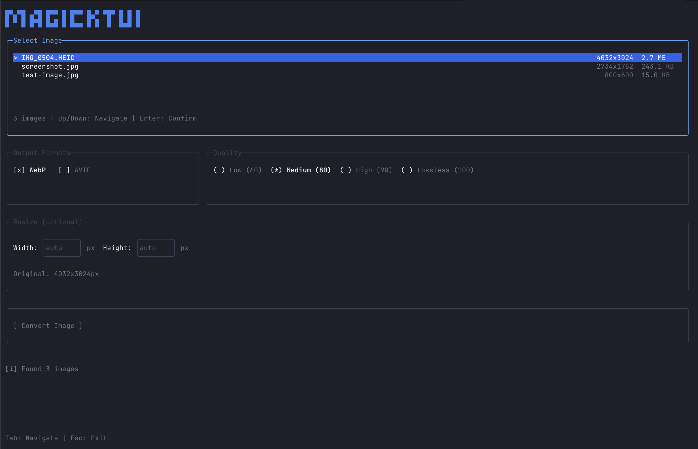

# magick-tui

A powerful, interactive Terminal User Interface (TUI) for image compression and conversion using ImageMagick. Easily convert and optimize images to modern formats like WebP and AVIF with an intuitive keyboard-driven interface.



## Features

- **Interactive TUI** - Keyboard-driven interface with intuitive navigation
- **Multiple Format Support** - Convert images to WebP and AVIF formats
- **Quality Control** - Choose from quality presets: Low (60), Medium (80), High (90), or Lossless (100)
- **Image Resizing** - Optional width and height resizing (no upscaling)
- **Real-time Preview** - See file sizes, dimensions, and conversion status in real-time
- **Batch Operations** - Process multiple images in your current directory
- **Wide Format Support** - Input: JPG, JPEG, PNG, WebP, AVIF, HEIC, HEIF, TIFF, BMP, GIF

## Requirements

- [Bun](https://bun.sh/) runtime
- [ImageMagick](https://imagemagick.org/) (for image processing)

## Installation

### Option 1: Install via Bun (Recommended)

**Note:** Requires [Bun](https://bun.sh/) to be installed.

```bash
# Global install
bun install -g @jsdr/magick-tui

# Run once without installing
bunx @jsdr/magick-tui
```

### Option 2: Download Pre-built Binary

Download the latest release for your platform and add it to your PATH:

#### macOS (Apple Silicon)
```bash
curl -L https://github.com/Jensderond/magick-tui/releases/latest/download/magick-tui-darwin-arm64 -o magick-tui
chmod +x magick-tui
mkdir -p ~/.local/bin
mv magick-tui ~/.local/bin/
```

#### Linux (x64)
```bash
curl -L https://github.com/Jensderond/magick-tui/releases/latest/download/magick-tui-linux-x64 -o magick-tui
chmod +x magick-tui
mkdir -p ~/.local/bin
mv magick-tui ~/.local/bin/
```

**Note:** Make sure `~/.local/bin` is in your PATH. Add this to your `~/.bashrc` or `~/.zshrc`:
```bash
export PATH="$HOME/.local/bin:$PATH"
```

### Option 3: Install from Source (Development)

```bash
git clone https://github.com/Jensderond/magick-tui.git
cd magick-tui
bun install
```

## Usage

### Start the Application

```bash
bun start
```

Or for development with hot reload:

```bash
bun run dev
```

The interface is intuitive and too easy to explain—just launch it and explore!

## Output

Converted images are saved in the same directory as the original file with the format appended to the filename:

```
input.jpg
├── input.webp (from WebP conversion)
└── input.avif (from AVIF conversion)
```

## How It Works

1. **Scans** the current directory for supported image formats
2. **Displays** file information including size and dimensions
3. **Lets you select** output formats, quality, and optional resizing
4. **Uses ImageMagick** to efficiently convert and compress images
5. **Updates** the file list to show newly created files

## Technologies

- **[Solid.js](https://www.solidjs.com/)** - Reactive UI framework
- **[OpenTUI](https://github.com/ThaUnknown/opentui)** - Terminal UI library
- **[ImageMagick](https://imagemagick.org/)** - Image processing
- **[Bun](https://bun.sh/)** - JavaScript runtime

## Tips & Best Practices

- **Quality Selection**: Use "Medium" (80) for a good balance of quality and file size
- **AVIF Format**: Modern format with excellent compression, best for newer browsers
- **WebP Format**: Wider browser support, good compression ratio
- **Resizing**: Always downscale images; upscaling is not permitted
- **Batch Processing**: Process images one at a time for better control

## Troubleshooting

### ImageMagick Not Found
Ensure ImageMagick is properly installed and in your system PATH. Try:
```bash
which convert  # Check if ImageMagick is installed
```

### Permission Denied
Make sure you have write permissions in the current directory.

### Disk Space Issues
Ensure you have enough free disk space for the converted images. Converted files are created in the same directory.

## License

MIT

## Contributing

Contributions are welcome! Feel free to open issues or submit pull requests.
